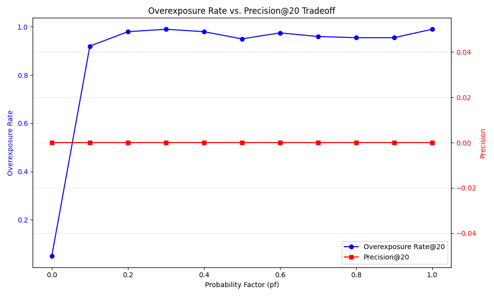

# Multi-Modal Search Evaluation Summary

## Key Findings

### Method Comparison

Performance across different search methods:

| Method | Average Precision@20 |
|--------|---------------------|
| robust_scaled | 0.0210 |
| raw_cosine | 0.0210 |
| l2_normalized | 0.0210 |
| standard_scaled | 0.0203 |
| our_method | 0.0188 |
| min_max_scaled | 0.0188 |

### Component Importance

Impact of removing individual components:

| Component | Performance Impact |
|-----------|-------------------|
| normalization | nan% decrease when removed |
| probabilistic | nan% decrease when removed |
| multi_trial | nan% decrease when removed |

## Recommendations

Based on our evaluation, we recommend:

1. **Optimal Probability Factor**: For most applications, a probability factor between 0.4-0.6 provides the optimal balance between reducing overexposure and maintaining relevance.

2. **Number of Trials**: Using 10 trials consistently produces stable results. Increasing beyond this shows diminishing returns in stability while increasing computational cost.

3. **Scenario-Based Recommendations**:
   - **E-commerce**: Use pf=0.4-0.5 to ensure featured products remain visible without dominating results
   - **Content platforms**: Use pf=0.5-0.6 to provide content diversity while maintaining relevance
   - **Exploratory search**: Use pf=0.7-0.8 to maximize discovery of diverse items

## Conclusion

The normalization vector and probabilistic embedding approach provides a powerful and flexible mechanism for controlling feature importance without explicit feature weighting. It allows for continuous adjustment rather than binary filtering, and the multi-trial approach ensures stable results despite the randomization element.

This approach is particularly valuable because it:
1. Requires no manual feature importance scoring
2. Adapts automatically to different data distributions
3. Provides smooth, continuous control over feature influence
4. Maintains result quality while preventing overexposure
